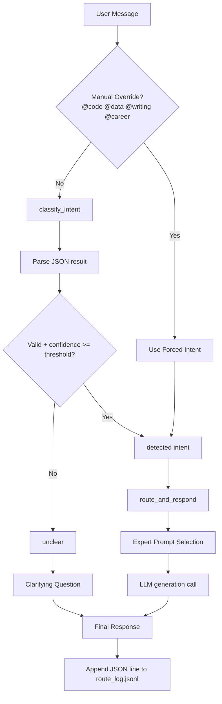
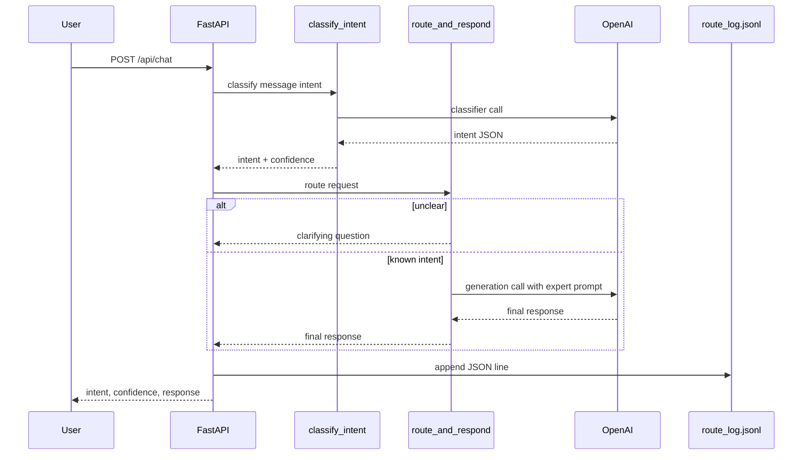

# Project Documentation - LLM-Powered Prompt Router

## 1. Objective

Build a production-ready service that classifies user intent and routes each message to a specialized AI persona instead of relying on a single monolithic prompt.

Supported intents:

- code
- data
- writing
- career
- unclear

## 2. Problem Statement

A single general-purpose prompt often produces broad, inconsistent outputs. In practical AI systems, intent-based routing is more reliable and cost-efficient:

- first call: low-cost intent classification
- second call: task-specific generation with a focused persona

This project implements that two-step architecture with robust fallback logic, confidence thresholding, observability, and containerized deployment.

## 3. Architecture Summary



## 4. Core Components

### 4.1 Intent Classifier

- Function: classify_intent(message)
- Uses a strict classifier prompt with allowed labels.
- Expected shape:

```json
{
  "intent": "string",
  "confidence": 0.0
}
```

- Handles malformed/non-JSON safely by returning:

```json
{
  "intent": "unclear",
  "confidence": 0.0
}
```

### 4.2 Prompt Router

- Function: route_and_respond(message, intent)
- Maps intent to one expert prompt from configurable prompt dictionary.
- For unclear intent, returns a direct clarification question and does not guess.

### 4.3 Prompt Configuration

Stored in app/prompts.py:

- CLASSIFIER_PROMPT
- EXPERT_PROMPTS (code, data, writing, career)
- CLARIFICATION_PROMPT

### 4.4 Logging and Observability

Every handled request appends one JSON object to route_log.jsonl with:

- intent
- confidence
- user_message
- final_response
- timestamp

This supports traceability and evaluation.

## 5. Prompt Engineering Strategy

### 5.1 Classifier Prompt Design

Design goals:

- narrow allowed label set
- JSON-only output contract
- confidence score requirement
- deterministic behavior via low temperature

### 5.2 Expert Persona Design

Each persona is intentionally opinionated with constraints:

- Code Expert: implementation-first, robust error handling
- Data Analyst: statistical framing and visualization suggestions
- Writing Coach: feedback-only (no full rewrite), actionable edits
- Career Advisor: concrete steps, goal- and level-aware guidance

This improves output quality by reducing role ambiguity.

## 6. Error Handling and Reliability

Implemented safeguards:

- malformed classifier output fallback to unclear
- unknown intent labels normalized to unclear
- confidence threshold fallback to unclear
- no API key scenario handled without crash
- explicit unclear clarification path

## 7. Testing Strategy

### 7.1 Scenario Coverage

- clear intent messages across all personas
- ambiguous and very short messages
- typo/noisy input
- mixed-intent statements
- manual override paths

### 7.2 Automated Tests

- tests/test_router.py: API-level scenario checks (15+ messages)
- tests/test_router_unit.py: deterministic unit checks for parser fallback, unclear routing, and JSONL logging keys

## 8. Containerization and Runtime

### 8.1 Dockerfile

- Python slim base image
- requirements installation
- app source copy
- Uvicorn startup on port 8000

### 8.2 docker-compose

- service: prompt-router
- environment variables with sensible defaults (optional override via shell or .env)
- log volume mapping to logs/
- restart policy for resilience

## 9. Execution Flow



## 10. Production Readiness Notes

Current strengths:

- clean separation of classifier and generator logic
- deterministic fallback behavior for ambiguous traffic
- structured JSONL routing telemetry
- portable deployment via Docker and Compose

Recommended hardening for production:

- retries with exponential backoff for API calls
- request tracing IDs and structured app logs
- rate limiting and authentication
- test-time LLM mocking for full CI determinism
- prompt/version registry for controlled prompt rollout
